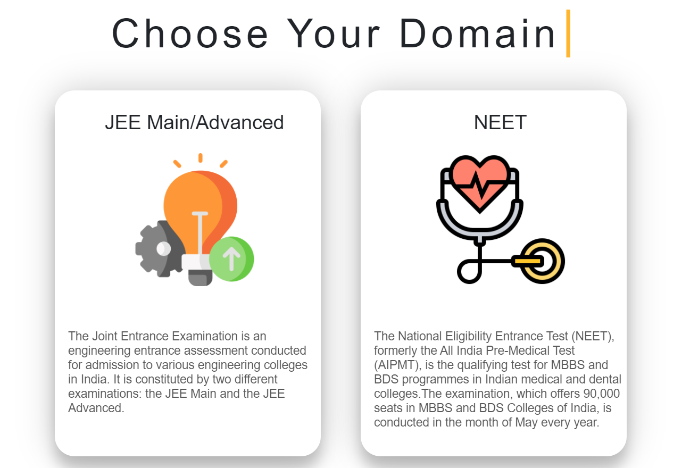

<!-- Tech stack
motive
the problem
the solution
Screenshots
The project scalability / Future plans
1. Books / Notes of UIET and then of every college
2. Expansion to other streams also like commerce and humanities 

Idea-> If what, that no one believes on the authenticity of the links? How will you make people believe on your website?-->

# The Problem
Since, every year the entrance exams are held and always there is a constant hustle around millions of students to get their desired seat. And here, the counselling plays a major role in admissions to any of the colleges in India.

So, the main problem is to find the major state counsellings and authentic links of the particular counselling website and it's schedule. And for which the students and parents have to really work hard and still cannot get something out of it. And it results in, them wasting a lot of time wandering around the YouTube and websites links.

# Motivation
So, we have been through the same scenerio a year ago and recently our juniors have finshed their counsellings and they went through the same hustle. So, we came up with an idea to conquer this problem and provide the authentic way to deal through it and hence saving much time and efforts.

# Our Solution
We, decided to build a webapp , a one stop destination to solve all this chaos. We have gathered all the important government counselling links for the respective states, so that a person or student of any state can check for their own and other state's counselling schedule and procedures, with just a click and does not have to wander around the fishy websites to get their desired search. And the site is made in a very understandable design and layout with very minimilistic and functional features with no extra content bothering around.

## Screenshots
#### Home Page

#### IIT/JEE Page

#### NEET Page

#### OBJECTIVE Page

#### CONTACT-US Page

# Team Name : Geeky Trio

This is Our Project 

### Technology Stack used:
- HTML
- CSS
- Bootstrap
- EJS
- Javascript
- Nodejs
- Express

 
